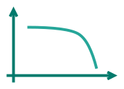
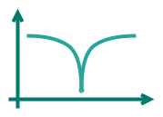

# Filters module.

In the filters module `filters.h` there's multiple digital filter.

-   __First Order Low Pass filter__

    ---

    

    [:octicons-arrow-right-24: LowPassFirstOrder](../docs/use-firstorder.md)

-   __Notch Filter__

    ---

     

    [:octicons-arrow-right-24: Notch filter](../docs/use-notchfilter.md)

-   __Phase Locked Loop__

    ---

    {width=250px}

    [:octicons-arrow-right-24: PllSinus](../docs/use-pll.md)

