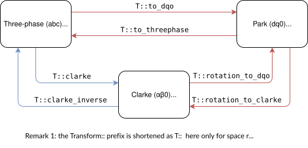

# Three-phase signals & transforms (Clarke, Park)

## Introduction

The Control library provides the classical coordinate transformations for three-phase signals.
In the context of transformation, the natural three-phase reference frame is named “abc”,
and these transformations allows projecting abc signals to two other useful reference frames:

- **Clarke**: transform signals to the stationnary, orthogonal, reference frame “αβ0” (sometimes named “αβγ”)
- **Park**: transform signals to the rotating, orthogonal, reference phase “dq0”

  - this tranform (and its inverse) needs a angle θ to definie the position of reference frame at the transformation instant 

To do so, the library also provides convience data structures to hold three-phase signals in the natural reference frame or one of the transformed reference frames. All are structures holding three `float32_t` values, but they differ by the naming of the fields:

- `three_phase_t`: fields `a`, `b` and `c` for the natural reference three-phase frame
- `clarke_t`: fields `alpha`, `beta` and `o`
- `dqo_t`: fields `d`, `q` and `o`

Warning: the 3rd coordinate of `clarke_t` and `dqo_t` is named with the small letter `o` rather than the digit `0` (so that it is a valid C++ identifier).

A signal expressed in one of these reference frame can be transformed to another one with one of these six functions:

- `Transform::clarke`: abc → αβ0
- `Transform::clarke_inverse`: αβ0 → abc
- `Transform::rotation_to_dqo`: αβ0 → dq0 (with angle θ as 2nd parameter)
- `Transform::rotation_to_clarke`: dq0 → αβ0 (with angle θ as 2nd parameter)
- `Transform::to_dqo`: abc → dq0 (with angle θ as 2nd parameter)
- `Transform::to_threephase`: dq0 → abc (with angle θ as 2nd parameter)

Remark: the `Transform::` prefix notation is use because these functions are declared as *static member functions* of the `Transform`.

<figure markdown="span">
{width=600}
<figcaption>Relationship between all transforms and data types of the Transform library</figcaption>
</figure>


## Use of transforms

Here is a example of applying Park transform to a current measurement with the `Transform::to_dqo` function.

Two steps are needed:

1. Declaration of data structures for the function inputs and outputs
2. Execution of the transform (generally done periodically)


### 1. Initialization and data structure declarations

First, as explained in the [Getting started](getting-started.md) doc, the Control library must be listed in the `lib_deps` in the `plaformio.ini` project configuration file.

Then, the `tranform.h` header file needs to be included in the application (in the top most lines the `main.cpp` file) using the following directive:

```Cpp
#include "transform.h"
```

Finally, the inputs and outputs of the transorm function(s) needs to be declared.

We assume here the case where those variables will be all global and `static`. 
We further assume the variable to be tranformed is a current and that the Park transform is done using a grid angle which is separately estimated using a PLL.
Thus variables are declared in the declaration section of the application as:

```Cpp
// Among other measurement variables
static three_phase_t Iabc; // three-phase measured injected current (A)
static dqo_t Idq; // dq injected current (A)
// Among other PLL variables
static float32_t grid_angle = 0.0; // grid angle (rad)
```

### 2. Execution of the transform

The transformation is run with the following function call:

```Cpp
Idq = Transform::to_dqo(Iabc, grid_angle);
```

However, in practice, the tranform needs to be run periodically because:

- the abc inputs probably change over time (if they are measurements or adjustable set points)
- the transformation angle also generally changes over time (integral of the frequency)

Thus the transform is usually computed in the periodic critical control task of the application. Here is a possible code fragment of this taks:

```
void control_task() {
	// Signal processing operations: measurements, PLL
	read_measurements(); // read new values of measurements, including Iabc
    run_grid_PLL(); // → update grid_angle for next control step, based of grid frequency estimate
	// rest of the control task [...]
```

where the `read_measurements()` function includes the following lines (using the Shield sensor API for measurements as an illustration):

```Cpp
inline void read_measurements() {
	// Measure currents
	meas_data = shield.sensors.getLatestValue(I1_LOW);
	if (meas_data != NO_VALUE) {
		Iabc.a = meas_data;
	}

	meas_data = shield.sensors.getLatestValue(I2_LOW);
	if (meas_data != NO_VALUE) {
		Iabc.b = meas_data;
	}

	meas_data = shield.sensors.getLatestValue(I3_LOW);
	if (meas_data != NO_VALUE) {
		Iabc.c = meas_data;
	}
	// Tranform currents
	Idq = Transform::to_dqo(Iabc, grid_angle);
}
```
